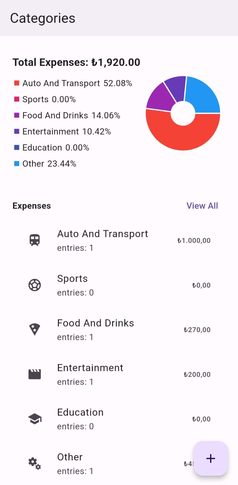
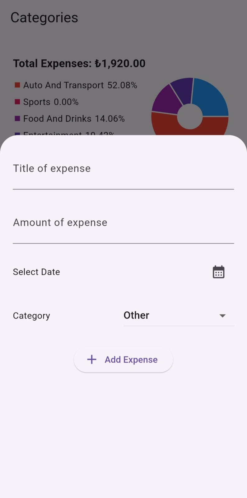
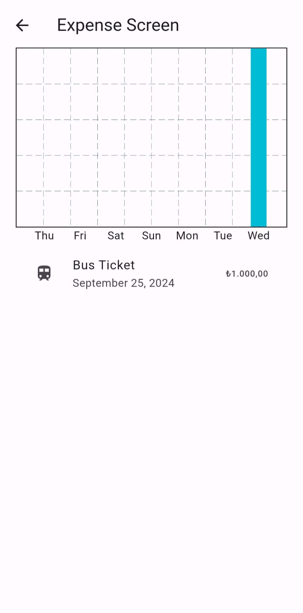
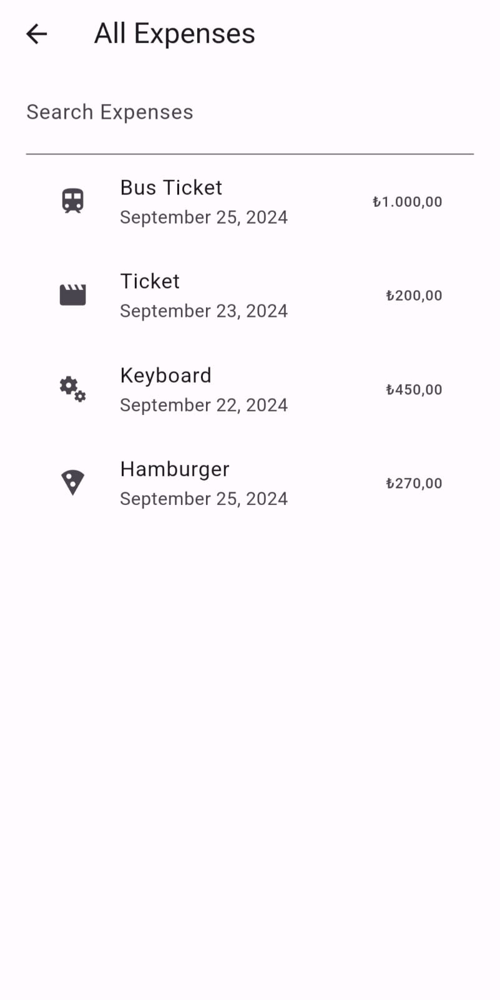

# Budget Tracker App - Flutter & SQLite

## Overview

This **Budget Tracker** application, built using **Flutter** and **SQLite**, helps users track their weekly spending across six different categories. The app allows users to enter expenses, view detailed weekly spending distributions, and manage their budgets more effectively.

## Key Features

- **Six Expense Categories**: Users can categorize their expenses into six predefined categories for easier tracking.
  
  

- **Add Expenses**: Easily add new expenses with the intuitive interface and categorize them accordingly.

  

- **Weekly Breakdown**: The app provides a detailed view of your weekly spending distribution, helping users to see where their money goes.

  

- **Expense List**: View a list of all expenses entered, sorted by date or category.

  

## User Experience

This budget tracker offers a clean, user-friendly interface that makes managing expenses simple and efficient. The SQLite database ensures data persistence, even after the app is closed.

---

## Contact

For any inquiries or feedback about the **Budget Tracker App**, feel free to reach out!

---

Thank you for checking out the **Budget Tracker App**!

---
---
---

# Bütçe Takip Uygulaması - Flutter & SQLite

## Genel Bakış

Bu **Bütçe Takip** uygulaması, **Flutter** ve **SQLite** kullanılarak geliştirildi. Kullanıcılar, altı farklı kategoride harcamalarını girerek haftalık harcama dağılımlarını görebilirler. Uygulama, harcamaların takibini kolaylaştırarak bütçe yönetimini daha verimli hale getirir.

## Öne Çıkan Özellikler

- **Altı Harcama Kategorisi**: Kullanıcılar, harcamalarını önceden tanımlanmış altı kategoriye göre sınıflandırabilirler.
  
  

- **Harcama Ekleme**: Kullanıcı dostu arayüz sayesinde yeni harcamalar kolayca eklenebilir ve uygun kategorilere atanabilir.

  

- **Haftalık Dağılım**: Uygulama, haftalık harcama dağılımını detaylı bir şekilde göstererek kullanıcıların paralarının nereye gittiğini görmelerini sağlar.

  

- **Harcama Listesi**: Girilen tüm harcamalar, tarih veya kategoriye göre sıralanmış bir liste halinde görüntülenebilir.

  

## Kullanıcı Deneyimi

Bu bütçe takip uygulaması, harcamaların yönetimini basit ve etkili hale getiren sade ve kullanıcı dostu bir arayüze sahiptir. SQLite veritabanı, uygulama kapandıktan sonra bile verilerin kalıcılığını sağlar.

---

## İletişim

**Bütçe Takip Uygulaması** hakkında sorularınız veya geri bildirimleriniz için bizimle iletişime geçebilirsiniz!

---

**Bütçe Takip Uygulaması'nı** incelediğiniz için teşekkür ederiz!
